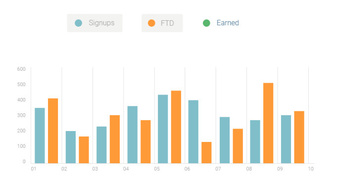

<p align="center">
<a href="https://grzegorz-jodlowski.github.io/dashboard-project/"></a>
</p>


# <p align="center">📈 Dashboard project</p>
<p align="center">Project for exercise of SCSS and vanilla JavaScript</p>

</br>

## Table of Contents

- [What's this project about?](#about)
- [Technologies used](#technologies)
- [What I learned?](#what)
- [Interesting code snippet](#interesting)
- [GitHub Pages](#gitHub)

</br>

## <a name="about"></a>What's this project about?

This is a SPA (Single Page Application) as a admin panel.
It can be implemented as a dashboard for many business fields, has a sidebar with navigation and a top bar with user data.
The whole page is coded with RWD (Responsive Web Desidn) rules.
Interesting thing is the interactive graph with adjustment to the window size.

</br>

## <a name="technologies"></a>Technologies used
- HTML
- CSS
- SCSS (with BEM approach)
- JavaScript
- npm
- GIT

</br>

## <a name="what"></a>What I learned?
- use <a href='https://necolas.github.io/normalize.css/'>normalize.css</a> and know the difference between normalize and reset styles,
- analyze the design to divide into components and sections,
- use <a href='http://getbem.com/introduction/'>BEM</a> in a more advanced way,
- create styleguide as an improvement in component design and know how <i>naked elements</i> will look like,
- test responsiveness using responsive mode in the browser inspector,
- create a mobile menu in the form of a sidebar (eg. <a href='https://tympanus.net/Development/SidebarTransitions/'>sidebar transitions</a>),
- handle the difficulty of displaying long content on a page that cannot be reduced (eg. <a href='https://codepen.io/SitePoint/pen/azeYqx'>Responsive Table with Tablesaw</a>),
- add a scrolling wrapper to part of the page (eg. <a href='https://css-tricks.com/pure-css-horizontal-scrolling/'>CSS tricks</a>),
- create Bootstrap style responsive grid,
-
-
-
- VS plugins


</br>

## <a name="interesting"></a>Interesting code snippet (for me of course 😉)
- ...

```css

}
```

</br>


## <a name="gitHub"></a>GitHub Pages
<a href="https://grzegorz-jodlowski.github.io/dashboard-project/">Dashoard project</a>


